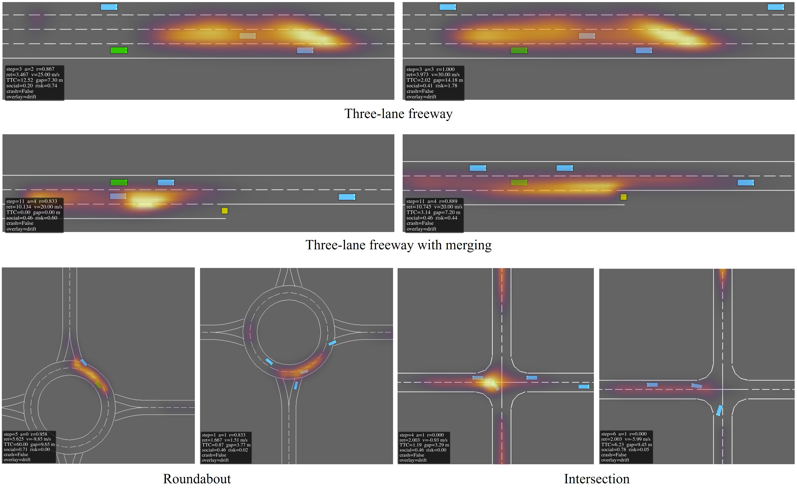

# SAFER: Socially-aware field-enhanced reinforcement learning for autonomous driving in interactive traffic 

A physics-informed propagated risk field can serve as a structured intermediate representation that improves RL tactical planning by making safety, progress, and externality measurable and learnable.
Unlike prior risk-aware RL methods that use instantaneous scalar risk penalties, this model learns a differentiable PDE-governed risk field and explicitly maps the field to surrounding-vehicle exposure and social externality. This allows risk to influence both the policy observation and the reward hierarchy.

Preliminmary model for PDE-governed risk field propagation modeling used could be found at [DRIFT](https://github.com/PeterWANGHK/DRIFT.git)


- Problem: socially friendly autonomous driving needs safety, progress, and low externality.
- Gap: risk-aware RL often uses scalar or instantaneous risk and lacks physically grounded risk propagation.
- Solution: PINN-learned PDE risk field embedded into tactical RL and MPC--CBF execution.
- Contributions: PDE/PINN field surrogate, externality-aware social score, risk-guided RL policy, closed-loop validation.

### PINN training
```
python pinn_risk_field.py --dataset inD --recording all --epochs 3000 --q_smooth --w_data 1.0 --w_phys 0.5 --w_ic 0.2 --w_bc 0.2 --w_smooth 0.3 --n_data 4096 --n_colloc 4096 --pts_per_snap 400 --save_model pinn_inD_all.pt
```
### demonstrations of the numerically solved risk field and PINN generated risk field:

### PINN field output in various environment configurations (highway, highway with merging, roundabout, intersection)


(The environment configurations are forked from [HighwayEnv](https://github.com/Farama-Foundation/HighwayEnv.git))

### Dataset processing
```
# Load the recorded trajectories:
python run_track_visualization.py --dataset [name of the dataset (e.g., highD; SQM-N-4)] --recording 00
# Example: load the behaviors from the SQM-N-4 dataset and store into .npz file 
python -m rl.data.historical_extractor --dataset SQM-N-4 --data-dir data/SQM-N-4   --out-path rl/checkpoints/bc_sqm_v3.npz
```

## Set1: HighwayEnv Configurations
### RL training and evaluation in heterogeneous traffic (PPO only)
```
# 1. Extract ALL recordings into one dataset
python -m rl.data.historical_extractor --data-dir data/exiD --recordings all --out-path rl/checkpoints/bc_dataset_full.npz --horizon-sec 1.5

# 2. BC pretrain on the full dataset
python -m rl.train_bc --dataset rl/checkpoints/bc_dataset_full.npz --out rl/checkpoints/decision_policy_bc.pt

# 3. PPO fine-tune (with the new opportunity-aware reward)
python -m rl.train_decision_ppo --bc-checkpoint rl/checkpoints/decision_policy_bc.pt --out rl/checkpoints/decision_policy_ppo.pt --total-steps 200000

# 4. Evaluate (on both pure car traffic or heterogeneous traffic)
# in heterogenous traffic with truck-trailer occlusion and merging
python highway_test.py --models RL-PPO IDEAM DREAM --rl-decision-checkpoint rl/checkpoints/decision_policy_ppo.pt --steps 250
# in pure car traffic
python highway_test.py --scenario-mode purecar --ego-start-lane center --rl-policy-mode decision --rl-decision-checkpoint rl/checkpoints/decision_policy_ppo.pt --models all --mode single
# in suddent merging scenario: (compare against baseline MPC-CBF)
python uncertainty_merger.py --models "RL-PPO" "IDEAM" --steps 100 --rl-policy-mode ppo --rl-checkpoint rl/checkpoints/ppo_best.pt --save-dir figsave_merger_rl_vs_ideam --save-frames false

```
### Complete Implementation (updated on 25 Apr 2026)
```bash
# Train BC (if not already trained)
python -m rl.train\_bc --out rl/checkpoints/decision\_policy\_bc.pt

# Train PPO v3
python -m rl.train\_decision\_ppo \\
  --bc-checkpoint rl/checkpoints/decision\_policy\_bc.pt \\
  --out rl/checkpoints/decision\_policy\_ppo\_v3.pt \\
  --total-steps 200000 --rollout-steps 2048 \\
  --entropy-coef 0.05 --lr 1e-4 \\
  --log-path rl/logs/decision\_ppo\_v3\_log.json

# Main paper figure
python -m rl.plot\_training\_curves \\
  --logs rl/logs/decision\_ppo\_v3\_log.json \\
  --out figures/ppo\_training.pdf --diagnostic

# Evaluation — merger scenario
python uncertainty\_merger.py \\
  --rl-policy-mode decision \\
  --rl-decision-checkpoint rl/checkpoints/decision\_policy\_ppo\_v3.pt \\
  --steps 100 --models all --save-dir figsave\_merger\_v3\_rl

# Evaluation — 3-lane dense highway
python highway\_test.py \\
  --rl-policy-mode decision \\
  --rl-decision-checkpoint rl/checkpoints/decision\_policy\_ppo\_v3.pt \\
  --steps 400 --save-dir figsave\_test\_v3\_rl
```

### Datasets used in this project (download links):
[Ubiquitous Traffic Eyes](http://www.seutraffic.com/#/download)

[leveLXData](https://levelxdata.com/)


### Example snapshots of agent performances
Comparing the Social-friendly and risk-aware RL agent with the baseline RL and IDM/MOBIL in roundabout scenario: The IDM/MOBIL leads to a collision, while the baseline RL agent leads to over-conservative behavior


## Set2: MetaDrive Configurations
(The environment configurations are forked from [MetaDrive](https://github.com/metadriverse/metadrive.git))

### Algorithm Compatibility

| Algorithm | SB3 action space | Use these protocols |
|---|---|---|
| PPO | Discrete or continuous | Main paper uses discrete `matched_*`; continuous is also supported |
| DQN | Single discrete action only | `matched_*` or `matched_*_respawn` |
| SAC | Continuous `Box([-1,1]^2)` | `matched_*_continuous` or `matched_*_respawn_continuous` |
| TD3 | Continuous `Box([-1,1]^2)` | `matched_*_continuous` or `matched_*_respawn_continuous` |
| DDPG | Continuous `Box([-1,1]^2)` | `matched_*_continuous` or `matched_*_respawn_continuous` |

Stock protocols use MetaDrive's default observation and reward. Our protocols append the PINN learned risk feature vector, apply risk/comfort reward shaping, and compute risk exposure metrics.


### Training Commands

#### Official MetaDrive Notebook Reference

This reproduces the tutorial-style PPO sanity check. It is not the main fair
benchmark.

```powershell
python rl/train_metadrive_stock.py
```

#### PPO Specialist Runs With Moving Traffic

Straight:

```powershell
python rl/train_metadrive_sb3.py --protocol matched_stock_straight_respawn --algo ppo --steps 1000000 --n-envs 4 --run-name matched_stock_straight_respawn_ppo_1m
python rl/train_metadrive_sb3.py --protocol matched_social_risk_straight_respawn --algo ppo --steps 1000000 --n-envs 4 --reward-profile risk_only --run-name matched_social_risk_straight_respawn_ppo_1m
```

Intersection:

```powershell
python rl/train_metadrive_sb3.py --protocol matched_stock_intersection_respawn --algo ppo --steps 1000000 --n-envs 4 --run-name matched_stock_intersection_respawn_ppo_1m
python rl/train_metadrive_sb3.py --protocol matched_social_risk_intersection_respawn --algo ppo --steps 1000000 --n-envs 4 --reward-profile risk_only --run-name matched_social_risk_intersection_respawn_ppo_1m
```

Merge, roundabout, and curve follow the same naming pattern:

```powershell
python rl/train_metadrive_sb3.py --protocol matched_stock_merge_respawn --algo ppo --steps 1000000 --n-envs 4 --run-name matched_stock_merge_respawn_ppo_1m
python rl/train_metadrive_sb3.py --protocol matched_social_risk_merge_respawn --algo ppo --steps 1000000 --n-envs 4 --reward-profile risk_only --run-name matched_social_risk_merge_respawn_ppo_1m

python rl/train_metadrive_sb3.py --protocol matched_stock_roundabout_respawn --algo ppo --steps 1000000 --n-envs 4 --run-name matched_stock_roundabout_respawn_ppo_1m
python rl/train_metadrive_sb3.py --protocol matched_social_risk_roundabout_respawn --algo ppo --steps 1000000 --n-envs 4 --reward-profile risk_only --run-name matched_social_risk_roundabout_respawn_ppo_1m

python rl/train_metadrive_sb3.py --protocol matched_stock_curve_respawn --algo ppo --steps 1000000 --n-envs 4 --run-name matched_stock_curve_respawn_ppo_1m
python rl/train_metadrive_sb3.py --protocol matched_social_risk_curve_respawn --algo ppo --steps 1000000 --n-envs 4 --reward-profile risk_only --run-name matched_social_risk_curve_respawn_ppo_1m
```

Mixed-map generalization:

```powershell
python rl/train_metadrive_sb3.py --protocol matched_stock_mixed_respawn --algo ppo --steps 2000000 --n-envs 4 --run-name matched_stock_mixed_respawn_ppo_2m
python rl/train_metadrive_sb3.py --protocol matched_social_risk_mixed_respawn --algo ppo --steps 2000000 --n-envs 4 --reward-profile risk_only --run-name matched_social_risk_mixed_respawn_ppo_2m
```

CUDA is optional:

```powershell
python rl/train_metadrive_sb3.py --protocol matched_social_risk_intersection_respawn --algo ppo --steps 1000000 --n-envs 4 --reward-profile risk_only --run-name matched_social_risk_intersection_respawn_ppo_1m_cuda --device cuda
```


#### DQN Baselines

DQN uses the same discrete protocols as PPO:

```powershell
python rl/train_metadrive_sb3.py --protocol matched_stock_intersection_respawn --algo dqn --steps 1000000 --n-envs 4 --run-name matched_stock_intersection_respawn_dqn_1m
python rl/train_metadrive_sb3.py --protocol matched_social_risk_intersection_respawn --algo dqn --steps 1000000 --n-envs 4 --reward-profile risk_only --run-name matched_social_risk_intersection_respawn_dqn_1m
```

#### SAC, TD3, and DDPG Baselines

Use continuous-action protocols:

```powershell
python rl/train_metadrive_sb3.py --protocol matched_stock_intersection_respawn_continuous --algo sac --steps 1000000 --n-envs 4 --run-name matched_stock_intersection_respawn_sac_1m
python rl/train_metadrive_sb3.py --protocol matched_social_risk_intersection_respawn_continuous --algo sac --steps 1000000 --n-envs 4 --run-name matched_social_risk_intersection_respawn_sac_1m

python rl/train_metadrive_sb3.py --protocol matched_stock_intersection_respawn_continuous --algo td3 --steps 1000000 --n-envs 4 --run-name matched_stock_intersection_respawn_td3_1m
python rl/train_metadrive_sb3.py --protocol matched_social_risk_intersection_respawn_continuous --algo td3 --steps 1000000 --n-envs 4 --run-name matched_social_risk_intersection_respawn_td3_1m

python rl/train_metadrive_sb3.py --protocol matched_stock_intersection_respawn_continuous --algo ddpg --steps 1000000 --n-envs 4 --run-name matched_stock_intersection_respawn_ddpg_1m
python rl/train_metadrive_sb3.py --protocol matched_social_risk_intersection_respawn_continuous --algo ddpg --steps 1000000 --n-envs 4 --run-name matched_social_risk_intersection_respawn_ddpg_1m
```

#### Example simulation of the training trial and error for baseline TD3, DDPG agent in unsignalized intersection scenarios (with some randomly initialized traffic):


#### Example simulation of the training trial and error for baseline PPO agent in rounabout scenarios (with some randomly initialized traffic):


Some problems could be found from the baseline RL agent: 
- high steering magnitude;
- high steering-change rate;
- high throttle-change rate;
- high jerk;
- and poor route completion due to collision

#### Evaluation Commands

Planner specs use:

```text
label@protocol:path/to/final.zip
idm@protocol
random@protocol
```

The label suffix selects the SB3 loader: `_dqn`, `_sac`, `_td3`, `_ddpg`; no
suffix defaults to PPO.

PPO stock/risk/IDM comparison:

```powershell
python rl/eval_metadrive.py --run-name eval_intersection_respawn_ppo `
  --seeds 10000:10020 --densities 0.3 `
  --planners "stock_ppo@matched_stock_intersection_respawn:rl/checkpoints/metadrive/matched_stock_intersection_respawn_ppo_1m/final.zip,risk_ppo@matched_social_risk_intersection_respawn:rl/checkpoints/metadrive/matched_social_risk_intersection_respawn_ppo_1m/final.zip,idm@matched_stock_intersection_respawn"
```

Multi-algorithm comparison:

```powershell
python rl/eval_metadrive.py --run-name eval_intersection_respawn_all_algos `
  --seeds 10000:10020 --densities 0.3 `
  --planners "stock_ppo@matched_stock_intersection_respawn:rl/checkpoints/metadrive/matched_stock_intersection_respawn_ppo_1m/final.zip,risk_ppo@matched_social_risk_intersection_respawn:rl/checkpoints/metadrive/matched_social_risk_intersection_respawn_ppo_1m/final.zip,stock_dqn@matched_stock_intersection_respawn:rl/checkpoints/metadrive/matched_stock_intersection_respawn_dqn_1m/final.zip,risk_dqn@matched_social_risk_intersection_respawn:rl/checkpoints/metadrive/matched_social_risk_intersection_respawn_dqn_1m/final.zip,stock_sac@matched_stock_intersection_respawn_continuous:rl/checkpoints/metadrive/matched_stock_intersection_respawn_sac_1m/final.zip,risk_sac@matched_social_risk_intersection_respawn_continuous:rl/checkpoints/metadrive/matched_social_risk_intersection_respawn_sac_1m/final.zip,idm@matched_stock_intersection_respawn"
```

If evaluating an old trigger-trained checkpoint under moving traffic only for
diagnosis:

```powershell
python rl/eval_metadrive.py --run-name eval_trigger_checkpoint_respawn_stress `
  --traffic-mode respawn --seeds 10000:10005 --densities 0.3 `
  --planners "risk_ppo@matched_social_risk_intersection:rl/checkpoints/metadrive/matched_social_risk_intersection_ppo_1m/final.zip,idm@matched_stock_intersection"
```

#### Visualizations

3D Panda3D view:

```powershell
python rl/watch_metadrive_agent.py --planner rl --algo ppo `
  --protocol matched_social_risk_intersection_respawn `
  --checkpoint rl/checkpoints/metadrive/matched_social_risk_intersection_respawn_ppo_1m/final.zip `
  --view 3d --episodes 3 --seed 10000 --density 0.3
```

Top-down viewer:

```powershell
python rl/watch_metadrive_agent.py --planner rl --algo ppo `
  --protocol matched_social_risk_intersection_respawn `
  --checkpoint rl/checkpoints/metadrive/matched_social_risk_intersection_respawn_ppo_1m/final.zip `
  --view top_down --episodes 3 --seed 10000 --density 0.3
```
#### Example simulation of our proposed PPO agent in curvy highway scenarios:


#### Example simulation of DDPG agent in roundabout scenarios:


#### Example simulations of SAC agents in roundabout scenarios (from left to right: baseline SAC; risk-aware SAC (w/o social); social-risk SAC (our proposed full model)):


#### BEV Risk-Field Overlay


```powershell
python rl/watch_metadrive_agent.py --planner rl `
--protocol matched_stock_merge_respawn `
--checkpoint rl/checkpoints/metadrive/matched_stock_merge_respawn_ppo_1m/final.zip `
--view top_down --risk-overlay drift --episodes 3 --seed 10000 --density 0.3
```

#### Training Reward/Return Plots

Use the unified plotter when comparing training curves across MetaDrive and
HighwayEnv. It normalizes local logs into `timesteps`, average reward, and
episode return:

```powershell
python rl/plot_rl_training_reward_return.py `
  --runs "MetaDrive Stock PPO=rl/logs/metadrive/matched_stock_ppo/progress.csv" `
         "MetaDrive Risk DQN=rl/logs/metadrive/matched_social_risk_intersection_respawn_dqn_1m/progress.csv" `
         "HighwayEnv Social PPO=rl/logs/social_ppo_a5/summary.json" `
  --out rl/logs/figures/training_reward_return
```

Outputs:

- `training_reward_return.png`
- `training_reward_return.pdf`
- `training_reward_return_data.csv`


### License
MIT LICENSE
