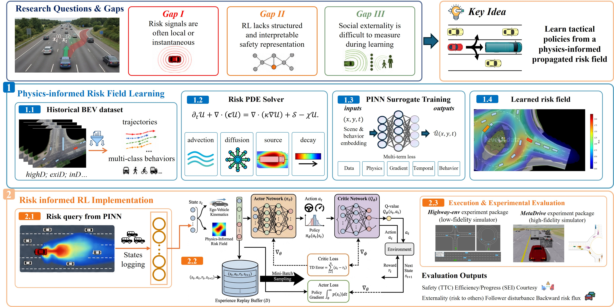

# SAFE-AD: Socially-Aware Field-Enhanced Reinforcement Learning for Autonomous Driving
Zian Wang, Wenjie Huang, Zejian Deng, Yiming Shu, Jiahui Xu, Yong Wang, Shen Li, Dongpu Cao, Chen Sun ✉


SAFE-AD is a research prototype for **socially-aware and risk-aware reinforcement learning in interactive autonomous driving**.
The central idea is to use a **physics-informed propagated risk field** as a structured intermediate representation for RL tactical planning. Instead of penalizing only instantaneous scalar risk, SAFE-AD models how risk propagates through traffic and maps this field to ego safety, surrounding-vehicle exposure, and social externality.

The preliminary PDE-governed risk-field model is based on [DRIFT](https://github.com/PeterWANGHK/DRIFT.git).




## Core Ideas

- **Propagated risk field**: models spatial-temporal traffic risk instead of only instantaneous ego risk.
- **PINN surrogate**: learns a differentiable approximation of the PDE-governed risk field.
- **Risk-aware RL**: appends field-derived risk features to the policy observation.
- **Social-aware reward shaping**: penalizes imposed risk, backward disturbance, jerk, abrupt steering, and unsafe close interactions.
- **MPC-CBF compatibility**: learned RL guidance can be used as a tactical layer while MPC-CBF enforces hard safety constraints.

---

## Installation and Environment

SAFE-AD targets Python 3.9+. A conda environment is recommended.

```bash
# 1. Create env
conda create -n safead python=3.10 -y && conda activate safead

# 2. PyTorch (CUDA 12.x build, matching the workstation in the paper)
pip install torch==2.11 --index-url https://download.pytorch.org/whl/cu128

# 3. Core RL + sim stack
pip install stable-baselines3==2.* gymnasium scienceplots matplotlib scipy python-docx
pip install metadrive-simulator==0.4.3
pip install highway-env

# 4. Project code
git clone https://github.com/<org>/SAFE-AD.git
cd SAFE-AD
pip install -r requirements.txt   # if provided
```

Hardware used in the paper: **NVIDIA GeForce RTX 5080 GPU (16 GB VRAM)** with PyTorch 2.11 + CUDA 12.8.

## Risk Field and PINN Demonstrations

Numerically solved risk field and PINN-generated risk field:


PINN field outputs across highway, merging, roundabout, and intersection scenarios:


## Datasets

The project uses naturalistic driving datasets for trajectory processing, behavior extraction, and field validation.

Dataset sources:

- [Ubiquitous Traffic Eyes](http://www.seutraffic.com/#/download)
- [leveLXData](https://levelxdata.com/) (highD, inD, rounD, exiD, uniD)

### Behavior / feature extraction

Each raw dataset is converted into per-frame behavioral features and tactical labels used downstream by both PINN training and behavior cloning.

```bash
# highD (full corpus)
python -m rl.data.historical_extractor \
  --dataset-format highD --data-dir data/highD --recordings all \
  --include-social --out-path rl/checkpoints/bc_highd_v4.npz

# exiD (full corpus, interaction-rich)
python -m rl.data.historical_extractor \
  --dataset-format exiD  --data-dir data/exiD  --recordings all \
  --include-social --out-path rl/checkpoints/bc_exid_v4.npz

# SQM-N-4 (Ubiquitous Traffic Eyes example)
python -m rl.data.historical_extractor \
  --dataset SQM-N-4 --data-dir data/SQM-N-4 \
  --out-path rl/checkpoints/bc_sqm_v3.npz

# Smoke / quick audit (one recording, capped tracks)
python -m rl.data.historical_extractor \
  --dataset-format highD --data-dir data/highD --recordings 01 \
  --limit-tracks 50 --include-social \
  --out-path rl/checkpoints/bc_highd_smoke.npz --no-manifest
```

Outputs are schema-v4 `.npz` files containing per-frame ego/neighbor states, lane-utility advantages, courtesy / disturbance / decision-quality labels, and field-based externality metrics (see [`rl/data/SOCIAL_FRIENDLINESS.md`](rl/data/SOCIAL_FRIENDLINESS.md)).

---

## PINN Risk-Field Training and Validation

The PINN is a differentiable surrogate of the PDE-governed propagated risk field (`pde_solver.py`). It is trained on the PDE-generated field as a teacher and on multi-dataset scenes.

### Train PINN surrogate

```bash
# Single-dataset (highway)
python pinn_highway_train.py \
  --out pinn_highway.pt

# Multi-dataset / multi-scene
python pinn_risk_field.py train \
  --datasets highD,inD,rounD,exiD \
  --epochs 200 \
  --out pinn_multi_all.pt

# Fine-tune from an existing checkpoint
python pinn_risk_field.py finetune \
  --init pinn_multi_all.pt --dataset rounD --epochs 50 \
  --out pinn_rounD_new.pt
```

Released checkpoints at the repository root: `pinn_highway.pt`, `pinn_inD_all.pt`, `pinn_rounD_all.pt`, `pinn_exiD_00.pt`, `pinn_multi_all.pt`, `pinn_risk_field.pt`.

### Validate / compare against the numerical PDE

```bash
# Field-by-field comparison: numerical PDE vs PINN, several scenarios
python pinn_compare_fields.py \
  --pinn pinn_multi_all.pt \
  --scenarios highway,merge,roundabout,intersection \
  --out figsave_PINN_compare

# Per-scene quantitative comparison (relative L2, gradient error, PDE residual)
python pinn_scene_compare.py \
  --pinn pinn_multi_all.pt --datasets inD,rounD \
  --out figsave_PINN_scene_compare
```

See [`PINN-finetune.md`](PINN-finetune.md) and [`IMPLEMENTATION_GUIDE_PINN_Improvements.md`](IMPLEMENTATION_GUIDE_PINN_Improvements.md) for fine-tuning recipes and ablations.

---

## Highway-env Experiments

The highway-env layer is the controlled and interpretable benchmark. It evaluates whether risk-field and social-interaction features improve tactical RL behavior in highway, merge, roundabout, and intersection scenarios.

The environment configurations are forked from [HighwayEnv](https://github.com/Farama-Foundation/HighwayEnv.git).

### Behavior cloning warm-start

```bash
python -m rl.train_bc \
  --dataset rl/checkpoints/bc_exid_v4.npz \
  --out rl/checkpoints/decision_policy_bc.pt
```

### RL training (the three reward arms)

```bash
# 1) Stock baseline (highway-env stock reward)
python -m rl.train_highwayenv_social_sb3 \
  --env-id highway-v0 --algo ppo --steps 1_000_000 \
  --reward-profile stock \
  --run-name highway_stock_ppo

# 2) Risk-only (DRIFT/PINN risk observation + risk penalty)
python -m rl.train_highwayenv_social_sb3 \
  --env-id highway-v0 --algo ppo --steps 1_000_000 \
  --reward-profile risk_only --pinn pinn_multi_all.pt \
  --run-name social_ppo_riskonly

# 3) Social-tuned (full social shaping; A5 ablation = full)
python -m rl.train_highwayenv_social_sb3 \
  --env-id highway-v0 --algo ppo --steps 1_000_000 \
  --reward-profile full --pinn pinn_multi_all.pt \
  --run-name social_ppo_a5

# DQN variant (discrete)
python -m rl.train_highwayenv_social_sb3 \
  --env-id highway-v0 --algo dqn --steps 1_000_000 \
  --reward-profile full --pinn pinn_multi_all.pt \
  --run-name social_dqn_a5
```

A multi-scenario benchmark driver runs the matrix in one shot:

```bash
python -m rl.run_highwayenv_social_benchmark \
  --envs highway-v0 merge-v0 roundabout-v0 intersection-v0 \
  --algos ppo dqn --arms stock risk_only full \
  --steps 1_000_000 --tag paper_highway
```

### Evaluation

```bash
# Headline comparison: trained RL vs IDM/MOBIL across scenarios
python -m rl.eval_highwayenv_social_sb3 \
  --checkpoint rl/checkpoints/social_ppo_a5/final.zip \
  --envs highway-v0 merge-v0 roundabout-v0 intersection-v0 \
  --episodes 20 --out rl/logs/eval_social_ppo_a5

# Quick visual roll-out (with PINN risk overlay)
python highway_test.py \
  --rl-policy-mode decision \
  --rl-decision-checkpoint rl/checkpoints/decision_policy_ppo.pt \
  --steps 400 --save-dir figsave_test_rl
```

Example snapshot comparing a social/risk-aware RL agent with baseline RL and IDM/MOBIL:


---

## MetaDrive Experiments

The MetaDrive layer tests whether the same field-enhanced RL design transfers to higher-fidelity driving with procedural maps, continuous vehicle dynamics, and interactive IDM traffic.

The environment configurations are forked from [MetaDrive](https://github.com/metadriverse/metadrive.git).

### Algorithm support

| Algorithm | Action Space | Usage |
|---|---|---|
| PPO | Discrete / continuous | Main discrete benchmark |
| DQN | Discrete | Discrete baseline |
| SAC | Continuous | Continuous-control baseline |
| TD3 | Continuous | Continuous-control baseline |
| DDPG | Continuous | Continuous-control baseline |
| IDM/MOBIL | Rule-based | Reference controller |

### Single-run training template (one config)

```bash
# Stock baseline
python rl/train_metadrive_sb3.py \
  --protocol matched_stock_intersection_respawn \
  --algo ppo --steps 1_000_000 --n-envs 4 --device cuda \
  --run-name matched_stock_intersection_respawn_ppo_1m

# Risk-only (DRIFT risk obs + risk penalty)
python rl/train_metadrive_sb3.py \
  --protocol matched_social_risk_intersection_respawn \
  --algo ppo --steps 1_000_000 --n-envs 4 --device cuda \
  --reward-profile risk_only \
  --run-name matched_social_risk_intersection_respawn_ppo_1m

# Social-tuned (decoupled weights used in the paper)
python rl/train_metadrive_sb3.py \
  --protocol matched_social_risk_intersection_respawn_continuous \
  --algo sac --steps 1_000_000 --n-envs 4 --device cuda \
  --reward-profile social_full \
  --lambda-risk 0.02 --lambda-jerk 0.0015 --lambda-steer-delta 0.001 \
  --lambda-steer-abs 0.0 --lambda-throttle-delta 0.001 \
  --w-hard-brake 0.03 --w-courtesy 0.05 --w-rear-ttc 0.02 --w-back-flux 0.02 \
  --run-name socialbench_intersection_social_sac_decoupled_1m
```

Continuous-control algorithms (SAC / TD3 / DDPG) require the `*_continuous` protocols (e.g. `matched_stock_intersection_respawn_continuous`).

### One-step matrix benchmark (recommended)

```bash
# Full {stock, social_full} x {PPO, DQN, SAC, TD3, DDPG} on one scenario, CUDA
python -m rl.run_social_benchmark --scenarios intersection --device cuda

# Several scenarios; also include the discrete PPO that pairs with DQN
python -m rl.run_social_benchmark \
  --scenarios intersection merge roundabout --ppo-track both --device cuda

# Preview without running
python -m rl.run_social_benchmark --scenarios intersection --dry-run
```

Run names follow `socialbench_<scenario>_<stock|social>_<algo>_1m`; the driver is **resumable** (existing `final.zip` is skipped).

### Multi-seed re-training (paper Fig. 5(a) shaded band)

```bash
W="--lambda-risk 0.02 --lambda-jerk 0.0015 --lambda-steer-delta 0.001 \
   --lambda-steer-abs 0.0 --lambda-throttle-delta 0.001 \
   --w-hard-brake 0.03 --w-courtesy 0.05 --w-rear-ttc 0.02 --w-back-flux 0.02"
for s in 1 2; do
  python rl/train_metadrive_sb3.py --protocol matched_stock_intersection_respawn_continuous       --algo sac --steps 1_000_000 --n-envs 4 --device cuda --seed $s                                --run-name msd_stock_sac_int_s$s
  python rl/train_metadrive_sb3.py --protocol matched_social_risk_intersection_respawn_continuous --algo sac --steps 1_000_000 --n-envs 4 --device cuda --seed $s --reward-profile risk_only       --run-name msd_risk_sac_int_s$s
  python rl/train_metadrive_sb3.py --protocol matched_social_risk_intersection_respawn_continuous --algo sac --steps 1_000_000 --n-envs 4 --device cuda --seed $s --reward-profile social_full $W --run-name msd_social_sac_int_s$s
done
```

### Evaluation

MetaDrive evaluation supports stock RL, risk-aware RL, social-risk RL, IDM and random baselines.

Planner format: `label@protocol:path/to/final.zip` (RL) or `idm@protocol` / `random@protocol`.

```bash
# Headline 3-arm evaluation at intersection (15 planners, 20 paired seeds)
python rl/eval_metadrive.py --run-name eval_intersection_3arm_full \
  --seeds 10000:10020 --densities 0.3 \
  --planners "stock_sac@matched_stock_intersection_respawn_continuous:rl/checkpoints/metadrive/matched_stock_intersection_respawn_sac_1m/final.zip,\
risk_sac@matched_social_risk_intersection_respawn_continuous:rl/checkpoints/metadrive/matched_social_risk_intersection_respawn_sac_1m/final.zip,\
social_sac@matched_social_risk_intersection_respawn_continuous:rl/checkpoints/metadrive/socialbench_intersection_social_sac_decoupled_1m/final.zip,\
idm@matched_stock_intersection_respawn_continuous"

# Traffic-density splits (Easy/Moderate/Hard)
python rl/eval_metadrive.py --run-name eval_intersection_sac_density \
  --seeds 10000:10020 --densities 0.1,0.3,0.5 \
  --planners "stock_sac@matched_stock_intersection_respawn_continuous:...sac_1m/final.zip,\
risk_sac@matched_social_risk_intersection_respawn_continuous:...sac_1m/final.zip,\
social_sac@matched_social_risk_intersection_respawn_continuous:...decoupled_1m/final.zip"

# Zero-shot transfer (intersection-trained social SAC on merge & roundabout)
python rl/eval_metadrive.py --run-name eval_zeroshot_social_sac \
  --seeds 10000:10020 --densities 0.3 \
  --planners "zeroshot_merge_sac@matched_social_risk_merge_respawn_continuous:.../socialbench_intersection_social_sac_decoupled_1m/final.zip,\
zeroshot_round_sac@matched_social_risk_roundabout_respawn_continuous:.../socialbench_intersection_social_sac_decoupled_1m/final.zip"

# CBF safety filter ON (continuous planners)
python rl/eval_metadrive.py --run-name eval_intersection_3arm_cbf --cbf-filter \
  --seeds 10000:10020 --densities 0.3 --planners "..."
```

The evaluator reports mean ± 95 % CI across paired seeds for every metric (Section 5 *Pillars*) plus per-step CPU `action_selection_ms` and the optional `cbf_intervention_rate`.

Main reported metrics, grouped into four pillars:

| Pillar | Metrics |
|---|---|
| Task performance | success rate, route completion, episode return |
| Safety and risk | collision rate, out-of-road rate, TTC violation, near-miss count, cumulative risk exposure, peak risk |
| Efficiency and flow | mean speed, progress, EI, SEI, SEMI |
| Comfort and sociality | jerk, steering-change rate, throttle-change rate, backward disturbance, imposed risk, social score |

## Visualization

3D simulator view:

```bash
python rl/watch_metadrive_agent.py --planner rl --algo sac \
  --protocol matched_social_risk_intersection_respawn_continuous \
  --checkpoint rl/checkpoints/metadrive/socialbench_intersection_social_sac_decoupled_1m/final.zip \
  --view 3d --episodes 3 --seed 10000 --density 0.3
```

Top-down view with risk-field overlay:

```bash
python rl/watch_metadrive_agent.py --planner rl --algo ppo \
  --protocol matched_stock_merge_respawn \
  --checkpoint rl/checkpoints/metadrive/matched_stock_merge_respawn_ppo_1m/final.zip \
  --view top_down --risk-overlay --episodes 3 --seed 10000 --density 0.3
```

Side-by-side risk-field overlay PNG (best for paper figures):

```bash
python rl/visualize_metadrive_comparison.py \
  --planners "stock_sac@matched_stock_intersection_respawn_continuous:.../sac_1m/final.zip,\
risk_sac@matched_social_risk_intersection_respawn_continuous:.../sac_1m/final.zip,\
social_sac@matched_social_risk_intersection_respawn_continuous:.../decoupled_1m/final.zip" \
  --seed 10000 --density 0.3 --max-steps 200 --step-stride 20 \
  --out rl/logs/metadrive/viz/intersection_3arm_sac_overlay.png
```

Example baseline / proposed rollouts:


---

## Reproducing the Paper Figures

The figure scripts read the eval / training logs produced above and emit PNG + PDF with the scienceplots IEEE style.

```bash
# Fig. A (MetaDrive: breadth + stability) — 3-panel
python docs/build_metadrive_training_figure.py        # -> docs/figA_metadrive_training.png/pdf

# Fig. B (Highway-env: depth of social objective) — 3-panel
python docs/build_highway_training_figure.py          # -> docs/figB_highway_training.png/pdf

# Reward/return compact (1x3, SAC, three scenarios, arms overlaid; smoothed + raw)
python docs/build_metadrive_sac_return_compact.py

# Multi-seed shaded learning curve + cross-seed table + Welch t-test
python rl/plot_rl_shaded_curves.py \
  --group "Stock SAC=rl/logs/metadrive/matched_stock_intersection_respawn_sac_1m/progress.csv,rl/logs/metadrive/msd_stock_sac_int_s1/progress.csv,rl/logs/metadrive/msd_stock_sac_int_s2/progress.csv" \
  --group "Risk SAC=..."  --group "Social SAC=..." \
  --metrics success route_completion --band ci \
  --out rl/logs/figures/intersection_sac_multiseed

# 4-pillar radar (Safety / Efficiency / Comfort / Courtesy)
python rl/plot_rl_radar.py --summary rl/logs/metadrive/eval_intersection_3arm_full/eval_summary.json \
  --planners stock_sac,risk_sac,social_sac,idm --out rl/logs/figures/intersection_sac_radar

# Density violins (Easy / Moderate / Hard)
python rl/plot_rl_density_violin.py \
  --episodes rl/logs/metadrive/eval_intersection_sac_density/eval_episodes.csv \
  --metric route_completion --out rl/logs/figures/intersection_density_violin

# Zero-shot transfer bars
python rl/plot_rl_zeroshot.py \
  --zeroshot rl/logs/metadrive/eval_zeroshot_social_sac/eval_summary.json \
  --native-template "rl/logs/metadrive/eval_{S}_3arm_full/eval_summary.json" \
  --native-label social_sac --out rl/logs/figures/zeroshot_social_sac

# Per-term reward-decomposition (credit assignment) — per algorithm
python rl/plot_reward_term_decomposition.py \
  --train-runs "Intersection=rl/logs/metadrive/socialbench_intersection_social_sac_decoupled_1m/progress.csv" \
               "Merge=rl/logs/metadrive/socialbench_merge_social_sac_decoupled_1m/progress.csv" \
               "Roundabout=rl/logs/metadrive/socialbench_roundabout_social_sac_decoupled_1m/progress.csv" \
  --out rl/logs/figures/social_sac_decomp

# Per-scenario 3-arm Word table (paper-grade)
python docs/build_3arm_scenario_docx.py   # -> docs/metadrive_{intersection,merge,roundabout}_3arm_summary.docx

# Combined cross-scenario Word doc (headline SAC table + 6 tables + 2-col analysis + Figs)
python docs/build_3arm_combined_docx.py   # -> docs/metadrive_3arm_combined_summary_withfigs.docx
```

## Replication Package Layout

```
SAFE-AD/
├── README.md                       # this file
├── requirements.txt                # pinned python deps
├── LICENSE
├── config.py                       # DRIFT grid/PDE config
├── pde_solver.py                   # numerical PDE risk field
├── pinn_risk_field.py              # PINN surrogate (train / eval / finetune)
├── pinn_highway_train.py           # PINN training script
├── pinn_compare_fields.py          # PINN vs PDE field-level comparison
├── pinn_scene_compare.py           # PINN per-scene quantitative comparison
├── pinn_*.pt                       # released PINN checkpoints (highway, inD, rounD, exiD, multi)
├── Integration/                    # DRIFT interface used by RL wrapper
├── rl/                             # RL training, evaluation, plotting (data + envs + plotters)
│   ├── env/                        # MetaDrive / HighwayEnv wrappers (incl. DRIFT wrapper)
│   ├── config/                     # protocols + RL config
│   ├── data/                       # historical_extractor, social_features, social_reward
│   ├── reward/                     # composed social reward
│   ├── safety/                     # CBF safety filter + MetaDrive adapter
│   ├── train_metadrive_sb3.py      # MetaDrive trainer
│   ├── run_social_benchmark.py     # one-step matrix driver (MetaDrive)
│   ├── train_highwayenv_social_sb3.py
│   ├── run_highwayenv_social_benchmark.py
│   ├── eval_metadrive.py           # MetaDrive evaluator
│   ├── eval_highwayenv_social_sb3.py
│   ├── plot_*.py                   # scienceplots figure generators
│   └── watch_metadrive_agent.py    # 3D / top-down viewer
├── metadrive/                      # MetaDrive fork (env configs)
├── HighwayEnv-master/              # HighwayEnv fork (env configs)
├── docs/                           # paper-figure builders + Word generators
│   ├── build_metadrive_training_figure.py
│   ├── build_highway_training_figure.py
│   └── build_metadrive_sac_return_compact.py
└── assests/                        # demo figures and gifs
```
