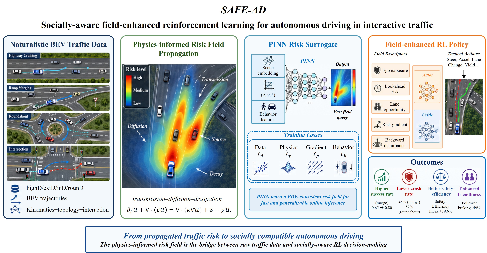

# SAFE-AD: Socially-Aware Field-Enhanced Reinforcement Learning for Autonomous Driving
Zian Wang, Wenjie Huang, Zejian Deng, Yiming Shu, Jiahui Xu, Yong Wang, Shen Li, Dongpu Cao, Chen Sun ✉

SAFE-AD is a research prototype for **socially-aware and risk-aware reinforcement learning in interactive autonomous driving**.
The central idea is to use a **physics-informed propagated risk field** as a structured intermediate representation for RL tactical planning. Instead of penalizing only instantaneous scalar risk, SAFE-AD models how risk propagates through traffic and maps this field to ego safety, surrounding-vehicle exposure, and social externality.

The preliminary PDE-governed risk-field model is based on [DRIFT](https://github.com/PeterWANGHK/DRIFT.git).

## Core Ideas

- **Propagated risk field**: models spatial-temporal traffic risk instead of only instantaneous ego risk.
- **PINN surrogate**: learns a differentiable approximation of the PDE-governed risk field.
- **Risk-aware RL**: appends field-derived risk features to the policy observation.
- **Social-aware reward shaping**: penalizes imposed risk, backward disturbance, jerk, abrupt steering, and unsafe close interactions.
