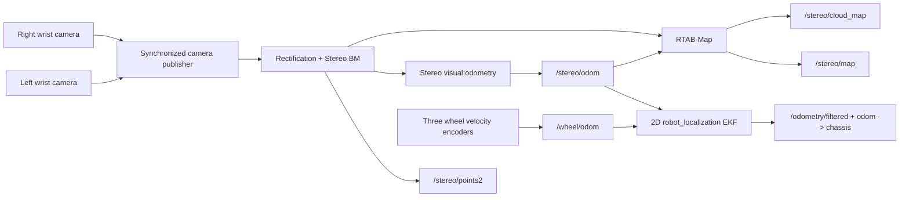
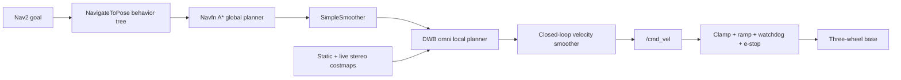

# XLeRobot 0.3 stereo mapping and navigation: expert-review handoff

Last updated: 2026-08-03

This directory is the current ROS 2 Jazzy mapping and navigation integration for the local
XLeRobot 0.3. This document assumes familiarity with the XLeRobot mechanical and software
architecture and focuses on this robot's calibration state, data flow, controller choices,
validated behavior, and remaining risks.

## Executive status

The robot model and measured arm/head joint states have been visually aligned with the real
hardware. The two wrist cameras can produce rectified images, disparity, live point clouds,
stereo visual odometry, and RTAB-Map data. Wheel encoder velocity and stereo pose are fused by
`robot_localization`; Nav2 starts successfully in dry-run and all managed nodes become active.

The system is **not yet accepted for autonomous physical navigation**. The wrist-stereo
intrinsics/extrinsics are still nominal URDF-derived values, stereo correspondence rejection is
frequent, and the current `maps/session_01.db` did not publish a usable static map or relocalize
during the latest navigation dry-run (`local map=0`, `WM=1`, Nav2 reported `no map received`).
Obstacle avoidance has been wired but has not yet passed controlled physical validation.

## Hardware and calibration state

### Connected hardware

| Function | Stable device | Current backing device |
|---|---|---|
| Physical left arm and head | `/dev/arm_left` | `/dev/ttyACM0` |
| Physical right arm and three-wheel base | `/dev/arm_right` | `/dev/ttyACM1` |
| Head/center RGB camera | `/dev/camera_center` | `/dev/video0` |
| Left wrist RGB camera | `/dev/camera_left` | `/dev/video2` |
| Right wrist RGB camera | `/dev/camera_right` | `/dev/video4` |

The mapping pipeline currently uses only the two wrist cameras. The center camera is not yet an
input to localization, mapping, or obstacle avoidance.

### Motor calibration and zero convention

The active Feetech calibration directory is:

```text
~/.cache/robocrew/calibrations/robots/so_follower/
```

| Chain | Motor | ID | Homing offset (ticks) | Calibrated raw range |
|---|---|---:|---:|---:|
| Left | shoulder pan | 1 | -277 | 1097–2934 |
| Left | shoulder lift | 2 | +798 | 941–3233 |
| Left | elbow flex | 3 | -956 | 878–3080 |
| Left | wrist flex | 4 | -442 | 836–2999 |
| Left | wrist roll | 5 | +1638 | 0–4095 |
| Left | gripper | 6 | -676 | 2024–3518 |
| Right | shoulder pan | 1 | +839 | 1177–3059 |
| Right | shoulder lift | 2 | -1706 | 879–3148 |
| Right | elbow flex | 3 | +165 | 913–3112 |
| Right | wrist flex | 4 | +420 | 884–3147 |
| Right | wrist roll | 5 | -1762 | 0–4095 |
| Right | gripper | 6 | -840 | 2043–3532 |
| Head | pan | 7 | -1864 | 0–4095 |
| Head | tilt | 8 | -1293 | 0–4095 |

The right wrist-roll servo was replaced and re-zeroed. The arm/head motor zero is the current
physical reference used by `move_all_joints_to_zero.py`. Grippers and wheels are excluded from
that coordinated zero command. Under gravity, the two elbows can settle a few degrees away from
their zero targets; the most recent read during validation was approximately +2.8° physical-left
elbow and +1.3° physical-right elbow, with the remaining arm/head joints close to zero.

The navigation hardware interface reads calibrated angles and publishes `/joint_states`; it does
not assume that commanded zero was reached exactly.

### URDF and joint mapping

The only active robot description is:

```text
/home/hkusas/lerobot/calibration_data/urdf/xlerobot.urdf
```

The model was manually matched to the real robot after motor re-zeroing. The real-hardware joint
mapping is baked into URDF joint origins/axes, so runtime publication uses the `direct` mapping.
The simulator-only `root -> root_arm_1_link_1 -> root_arm_1_link_2 -> chassis` chain was removed;
`chassis` is the ROS hardware root. This avoids a competing parent for `chassis` when odometry
publishes `odom -> chassis`.

`robot_state_publisher` emits a harmless KDL warning because the root `chassis` link has inertia.
Do not add a second parent above `chassis` without changing the odometry base frame and reviewing
the complete TF tree.

### Wrist-stereo calibration

Current calibration files:

```text
navigation/config/left.yaml
navigation/config/right.yaml
navigation/config/nominal_stereo.json
```

Current assumptions:

| Quantity | Value/state |
|---|---|
| Image size | 640 × 480 |
| Raw assumed focal length | 320 px |
| Rectified focal length | approximately 342.08 px |
| Nominal baseline | 0.2669129 m |
| Left optical frame | `Left_Arm_Camera_optical_frame` |
| Right optical frame | `Right_Arm_Camera_optical_frame` |
| Lens distortion | currently assumed zero |
| Extrinsics | derived from URDF at the locked arm pose |

These are **not measured camera intrinsics or stereo extrinsics**. They are sufficient to test
the software chain but not a defensible final calibration for metric mapping, obstacle clearance,
COLMAP, or 3DGS. The grippers occlude part of both wrist-camera images and the camera baseline and
orientation remain valid only while both arms stay torque-locked in the calibrated pose.

## Frames and estimation ownership

The intended TF tree is:

```text
map -> odom -> chassis -> arm/head links -> camera optical frames
```

| Transform | Owner |
|---|---|
| `map -> odom` | RTAB-Map |
| `odom -> chassis` | `robot_localization` EKF only |
| `chassis -> robot links/cameras` | `robot_state_publisher` |

Stereo odometry is configured with `publish_tf=false`; it publishes `/stereo/odom` but does not
compete with the EKF for `odom -> chassis`. RTAB-Map and stereo odometry are constrained to planar
3DoF (`x`, `y`, yaw), eliminating the observed visual z/roll/pitch drift that previously tilted
the entire robot and map.

## Sensing and state-estimation loop


```mermaid
flowchart LR
    WL["Left wrist camera"] --> PUB["Synchronized camera publisher"]
    WR["Right wrist camera"] --> PUB
    PUB --> RECT["Rectification + Stereo BM"]
    RECT --> PTS["/stereo/points2"]
    RECT --> VO["Stereo visual odometry"]
    VO --> VODOM["/stereo/odom"]
    ENC["Three wheel velocity encoders"] --> WODOM["/wheel/odom"]
    WODOM --> EKF["2D robot_localization EKF"]
    VODOM --> EKF
    EKF --> FODOM["/odometry/filtered + odom -> chassis"]
    RECT --> RTAB["RTAB-Map"]
    VODOM --> RTAB
    RTAB --> MAP["/stereo/map"]
    RTAB --> CLOUD["/stereo/cloud_map"]
```

The camera publisher grabs both USB cameras before retrieval and assigns the same ROS timestamp to
each pair. The requested application rate is 8 Hz; the V4L devices may report a 10 Hz mode. Actual
processed rates vary with scene and CPU load.

`stereo_image_proc` currently uses the lighter Block Matching algorithm with a 64-pixel disparity
range. Approximate synchronization is enabled. Strict synchronization previously caused
`/stereo/points2` to stop completely when disparity processing lagged behind CameraInfo; after the
change, live point-cloud output was observed at roughly 1–4.5 Hz.

The hardware interface reads `Present_Velocity` for wheel IDs 7/8/9 at 10 Hz, applies the inverse
of the current low-speed three-wheel mixer, integrates an approximate wheel pose, and publishes
`/wheel/odom`. The EKF deliberately fuses wheel **velocity**, not wheel pose, because the omni-wheel
base slips. Stereo supplies planar pose corrections. Wheel kinematic scale and EKF covariances are
engineering estimates and remain to be measured.

Important topics:

| Topic | Meaning | Expected behavior |
|---|---|---|
| `/joint_states` | Measured calibrated arm/head state | approximately 10 Hz |
| `/stereo/left/image_raw`, `/stereo/right/image_raw` | synchronized source images | target 8 Hz |
| `/stereo/disparity` | stereo disparity | scene/load dependent |
| `/stereo/points2` | live, single-frame 3D cloud | observed approximately 1–4.5 Hz |
| `/stereo/odom` | visual odometry | may stop or report quality 0 on visual failure |
| `/wheel/odom` | encoder-derived planar velocity/pose | validated approximately 10 Hz |
| `/odometry/filtered` | fused planar state used by Nav2 | validated approximately 10 Hz |
| `/stereo/cloud_map` | RTAB-Map accumulated 3D cloud | updates on accepted keyframes |
| `/stereo/map` | 2D occupancy grid used by Nav2 | must exist before planning |

## Mapping mode

RTAB-Map stores a graph, compressed sensor data, constraints, and map products in a `.db`; the
database is not merely a 2D image. The same database can produce a 3D accumulated cloud and a 2D
occupancy map. Robot motion is planar, while sensed geometry remains 3D.

RTAB-Map keyframe thresholds are 0.05 m translation or 0.05 rad rotation. Stop mapping with
Ctrl+C and wait for `Saving database/long-term memory...done!`.

```bash
source /opt/ros/jazzy/setup.bash
cd /home/hkusas/lerobot
ros2 launch navigation/xlerobot_stereo_mapping.launch.py \
  database_path:=/home/hkusas/lerobot/navigation/maps/session_01.db
```

For motorized mapping, the hardware interface must be the sole serial-bus owner:

```bash
# Terminal 1: wheel control, joint states, and wheel odometry
source /opt/ros/jazzy/setup.bash
cd /home/hkusas/lerobot
/home/hkusas/miniforge3/envs/lerobot/bin/python \
  -m navigation.xlerobot_hardware_interface --enable-wheels

# Terminal 2: mapping without the duplicate read-only joint publisher
source /opt/ros/jazzy/setup.bash
cd /home/hkusas/lerobot
ros2 launch navigation/xlerobot_stereo_mapping.launch.py \
  launch_hardware_joint_states:=false \
  database_path:=/home/hkusas/lerobot/navigation/maps/session_01.db

# Terminal 3: deliberately slow teleoperation
source /opt/ros/jazzy/setup.bash
ros2 run teleop_twist_keyboard teleop_twist_keyboard \
  --ros-args -p speed:=0.025 -p turn:=0.10
```

## Navigation policy and planning modules

This is a classical Nav2 navigation policy, not a learned policy.


```mermaid
flowchart LR
    GOAL["Nav2 goal"] --> BT["NavigateToPose behavior tree"]
    BT --> GLOBAL["Navfn A* global planner"]
    GLOBAL --> SMOOTH["SimpleSmoother"]
    SMOOTH --> DWB["DWB omni local planner"]
    COST["Static + live stereo costmaps"] --> DWB
    DWB --> VS["Closed-loop velocity smoother"]
    VS --> CMD["/cmd_vel"]
    CMD --> SAFE["Clamp + ramp + watchdog + e-stop"]
    SAFE --> WHEELS["Three-wheel base"]
```

### Global planning

- `nav2_navfn_planner::NavfnPlanner` with `use_astar=true`.
- Planning source: global costmap containing `/stereo/map`, live stereo obstacles, and inflation.
- Unknown cells are not traversable (`allow_unknown=false`).
- Planning tolerance is 0.25 m.
- `nav2_smoother::SimpleSmoother` refines the resulting grid path.

### Local trajectory policy

- `dwb_core::DWBLocalPlanner`, configured for holonomic `vx`, `vy`, and yaw.
- Candidate samples: 7 × 5 × 9; simulation horizon: 2.5 s.
- Critics: `RotateToGoal`, `Oscillation`, `BaseObstacle`, `GoalAlign`, `PathAlign`,
  `PathDist`, and `GoalDist`.
- Controller frequency: 8 Hz to leave compute headroom for stereo.
- Progress requirement: 0.05 m within 30 s.
- Goal tolerance: 0.12 m and 0.15 rad.

### Motion limits

| Quantity | Limit |
|---|---:|
| Forward/reverse | ±0.04 m/s |
| Lateral | ±0.025 m/s |
| Yaw | ±0.12 rad/s |
| Acceleration x/y/yaw | 0.06 / 0.04 / 0.18 |
| Deceleration x/y/yaw | -0.08 / -0.06 / -0.25 |

The Nav2 controller, closed-loop velocity smoother, and hardware clamp use the same limits.
The hardware control loop runs at 30 Hz, ramps wheel raw commands by at most 25 units per tick,
and forces zero after 0.30 s without a fresh `/cmd_vel`.

### Recovery behaviors

The current behavior server exposes spin, backup, drive-on-heading, and wait. Recovery rotation is
limited to 0.12 rad/s. These behaviors have not yet been physically validated against the wrist
camera blind zones; automatic recovery should be treated as untrusted until obstacle tests pass.

## Obstacle avoidance configuration

Robot footprint:

```text
[[-0.24, -0.27], [-0.24, 0.27], [0.24, 0.27], [0.24, -0.27]] m
```

An additional 0.02 m footprint padding is applied. The inflation radius is 0.38 m.

The local rolling costmap is 3 × 3 m at 0.05 m resolution. Its `VoxelLayer` marks and clears from
`/stereo/points2`. The global costmap combines the RTAB-Map static occupancy grid with a live
PointCloud2 obstacle layer. Current stereo obstacle bounds are:

| Parameter | Value |
|---|---:|
| Minimum obstacle height | 0.10 m |
| Maximum obstacle height | 1.20 m |
| Obstacle range | 0.20–2.50 m |
| Raytrace clearing range | 0.20–3.00 m |
| Voxel vertical extent | 0–1.28 m |

These values are plausible defaults, not validated safety distances. They may miss low obstacles
below 0.10 m, objects inside the 0.20 m near field, negative obstacles/drop-offs, glass, and
textureless surfaces. The wrist cameras are partly occluded by the grippers and move if arm torque
or joint position changes.

## Safety mechanisms

- Wheel hardware is disabled by default (`enable_wheels=false`).
- Actual wheel register writes require explicit `--enable-wheels` or `enable_wheels:=true`.
- Non-finite commands latch an emergency stop.
- Velocity is clamped, ramp-limited, and reset by a 0.30 s watchdog.
- On process exit, wheel goal velocity is zeroed and wheel torque is disabled.
- `/xlerobot/emergency_stop` zeros and latches the wheel target.
- `/xlerobot/clear_emergency_stop` clears the latch but waits for a new command.
- Only one process may own `/dev/arm_left` and `/dev/arm_right`.

```bash
ros2 service call /xlerobot/emergency_stop std_srvs/srv/Trigger '{}'
ros2 service call /xlerobot/clear_emergency_stop std_srvs/srv/Trigger '{}'
```

## Validation completed

- Real arm/head joint motion and RViz model were visually matched after calibration updates.
- Simulator-only root links causing a disconnected TF tree were removed.
- Hardware joint publication and robot-state TF were verified.
- Planar stereo odometry constraint removed the observed roll/pitch map tilt.
- Encoder-derived `/wheel/odom` was measured at approximately 10 Hz in no-write dry-run.
- `/odometry/filtered` and EKF `odom -> chassis` were measured at approximately 10 Hz.
- Duplicate stereo odometry TF publication is disabled.
- Approximate stereo synchronization restored `/stereo/points2` after strict-sync starvation.
- Nav2 controller, planner, smoother, behavior server, BT navigator, and velocity smoother all
  reached `active` in dry-run.
- Loaded Nav2 limits were checked as 0.04 / 0.025 / 0.12, and idle `/cmd_vel_guarded` was zero.

## Pending problems and required next steps

### P0: measured stereo calibration

Current odometry logs frequently report a large fraction of rejected stereo correspondences.
Measure each camera's intrinsics and the left-to-right extrinsic transform with a rigid calibration
target while both arms are torque-locked. Validate rectification with vertical disparity and
reprojection-error statistics. Re-generate `left.yaml`, `right.yaml`, and the URDF/camera TF
relationship from the measured result.

Acceptance criteria should include repeatability after power cycling and arm re-zeroing, not only
a visually plausible disparity image.

### P0: rebuild and validate a navigable map

The current `session_01.db` is approximately 4.3 MB and failed the latest localization dry-run:
RTAB-Map reported `local map=0`, `WM=1`; `/stereo/map` was unavailable to the global costmap.
Rebuild after stereo calibration, verify multiple accepted keyframes and loop closure, then test
cold-start relocalization from several known poses.

Acceptance criteria:

- `/stereo/map` is published after a cold navigation launch.
- RTAB-Map localization succeeds at the start pose and at multiple displaced poses.
- `map -> odom -> chassis` remains connected during slow translation and rotation.
- The 2D map scale and measured wall-to-wall distances agree within an explicit tolerance.

### P0: obstacle-avoidance validation

This is the nearest functional milestone after a valid map. Use soft, high-contrast obstacles and
a physical/tethered e-stop. Do not begin with people, stairs, glass, or valuable equipment.

Recommended sequence:

1. **Stationary perception test:** place obstacles at measured ranges and heights; verify points in
   `/stereo/points2`, marking in the local voxel costmap, and clearing after removal.
2. **Blind-zone characterization:** measure the gripper occlusion, minimum reliable depth, lateral
   field of view, and whether the footprint self-marks.
3. **Dry-run planning:** with wheels disabled, place Nav2 goals whose straight path is blocked;
   verify the global path and DWB local trajectories avoid inflated obstacles.
4. **Lifted-wheel direction test:** verify forward, reverse, lateral, and yaw signs and compare
   `/wheel/odom` signs to physical wheel motion.
5. **Tethered physical stop test:** approach one soft obstacle at 0.02 m/s, measure detection and
   stopping distance, then repeat at the configured 0.04 m/s maximum.
6. **Dynamic replan test:** introduce/remove a soft obstacle after motion begins and verify stop,
   clearing, and replanning without oscillation.

Define quantitative pass/fail thresholds for minimum clearance, maximum stop distance, perception
dropout duration, and false obstacle rate before enabling recovery behaviors.

### P1: wheel odometry calibration and EKF tuning

The current inverse mixer assumes that raw wheel velocity scales linearly to the configured body
limits. Measure wheel radius/effective scale, base radius, and each wheel's sign. Drive repeatable
straight, lateral, and yaw trajectories against external measurements. Tune wheel and stereo
covariances from residuals rather than hand-selected values. Test slip explicitly.

### P1: physical footprint and camera self-filtering

Measure the actual chassis envelope, including protrusions and cables, and update the footprint.
Determine whether the grippers/arms enter `/stereo/points2`; add a robot self-filter or depth ROI
mask if footprint clearing is insufficient.

### P1: sensing robustness and compute budget

Profile camera capture, rectification, disparity, odometry, RTAB-Map, EKF, costmaps, and DWB under
motion. The current point-cloud rate is low and variable. Establish minimum acceptable rates and
latency, monitor stale data, and decide whether to reduce resolution, decimate depth, or move to a
hardware-accelerated stereo implementation.

### P1: missing obstacle classes

The present positive-obstacle PointCloud2 pipeline does not reliably detect drop-offs, transparent
objects, or very low obstacles. Decide whether to add the calibrated head camera, a depth camera,
2D lidar, bump sensors, cliff sensors, or a dedicated near-field sensor. The head camera cannot be
used metrically until its pan/tilt zero and mount extrinsics are measured.

## Navigation launch and review commands

Dry-run only:

```bash
source /opt/ros/jazzy/setup.bash
cd /home/hkusas/lerobot
ros2 launch navigation/xlerobot_navigation.launch.py \
  database_path:=/home/hkusas/lerobot/navigation/maps/session_01.db \
  enable_wheels:=false
```

Physical navigation is intentionally explicit and should only follow successful dry-run,
localization, direction, and obstacle tests:

```bash
ros2 launch navigation/xlerobot_navigation.launch.py \
  database_path:=/home/hkusas/lerobot/navigation/maps/session_01.db \
  enable_wheels:=true
```

Useful diagnostics:

```bash
ros2 topic hz /stereo/points2
ros2 topic hz /stereo/odom
ros2 topic hz /wheel/odom
ros2 topic hz /odometry/filtered
ros2 run tf2_ros tf2_echo map chassis
ros2 lifecycle get /controller_server
ros2 lifecycle get /planner_server
ros2 topic echo /cmd_vel_guarded --once
```

Record source data separately; RTAB-Map database saving does not create a ROS bag:

```bash
ros2 bag record \
  -o /home/hkusas/lerobot/navigation/recordings/session_01 \
  /stereo/left/image_raw \
  /stereo/right/image_raw \
  /stereo/left/camera_info \
  /stereo/right/camera_info \
  /joint_states \
  /wheel/odom \
  /stereo/odom \
  /odometry/filtered \
  /tf \
  /tf_static
```

## Files for review

| File | Purpose |
|---|---|
| `xlerobot_stereo_mapping.launch.py` | camera, stereo, RTAB-Map, EKF, mapping RViz |
| `xlerobot_navigation.launch.py` | localization, hardware interface, Nav2, navigation RViz |
| `publish_stereo_cameras.py` | paired USB capture and synchronized ROS publication |
| `xlerobot_hardware_interface.py` | joint state, wheel encoder odometry, safe `/cmd_vel` bridge |
| `config/left.yaml`, `config/right.yaml` | current nominal rectification calibration |
| `config/nominal_stereo.json` | nominal baseline and URDF-derived stereo transform |
| `config/rtabmap.ini` | planar RTAB-Map and occupancy configuration |
| `config/ekf.yaml` | wheel/stereo 2D fusion |
| `config/nav2_params.yaml` | planner, controller, costmaps, behavior, velocity limits |
| `../calibration_data/urdf/xlerobot.urdf` | active calibrated robot description |

## Questions for expert review

1. Is the rigid wrist-camera arrangement mechanically repeatable enough for calibrated stereo, or
   should the cameras be remounted independently of the grippers/arms?
2. Should stereo visual odometry remain a separate pose correction into the EKF, or should RTAB-Map
   consume fused odometry directly after topic separation is refactored?
3. Are DWB and the current holonomic velocity mixer appropriate for this three-wheel geometry, or
   would MPPI with a calibrated omni motion model provide materially safer local behavior?
4. Is the current footprint/inflation policy sufficient for the cart and arm overhang throughout
   the locked navigation pose?
5. Which additional sensor is preferred for near-field, low-obstacle, transparent-object, and
   cliff coverage given the wrist-camera occlusion?
6. What measurable acceptance thresholds should gate the transition from dry-run to tethered
   physical navigation?
